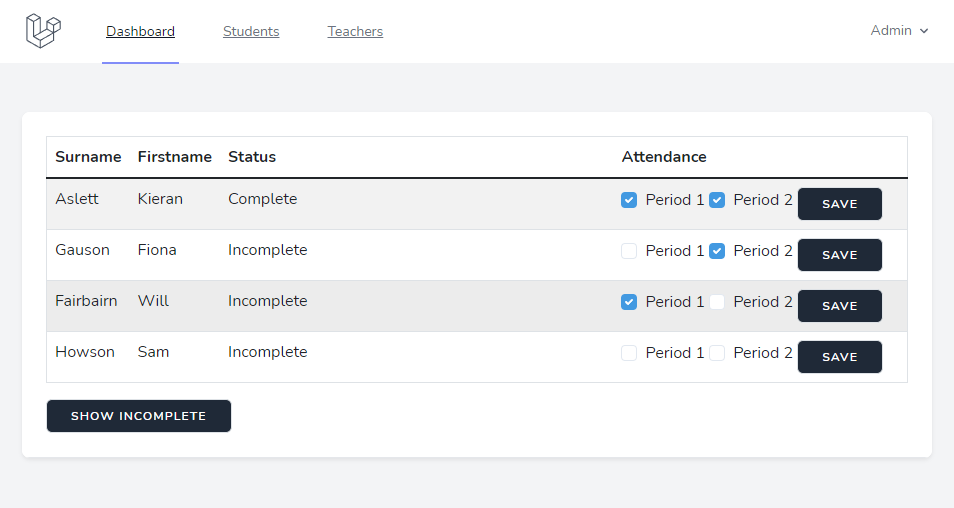

# Subject Support Laravel
Previous Subject Support system rebuilt using Laravel PHP framework.

# Dependencies
- PHP
- Composer

# Install
- Clone the repository
- Install Dependencies (`composer update`)
- Set Database in `.env` or create `database.sqlite` in `./database`
- Run `php artisan migrate` to initialize the database
- Run `php artisan serve` to start the Web Server

# Usage
- Admin Username: `admin`
- Admin Password: `admin`
- Admin can add Students and Teachers in their respective pages
- Admin can allocate students to Teachers on the Teacher page
- Attendance for the current week is on the dashboard
- Admin can see all attendance
- Teachers can only see the attendance for students they're assigned to
- Users are able to set completion of each period of support undertaken by a Student
- Users are able to see which students they are assigned have incomplete attendance records

# Screenshots

